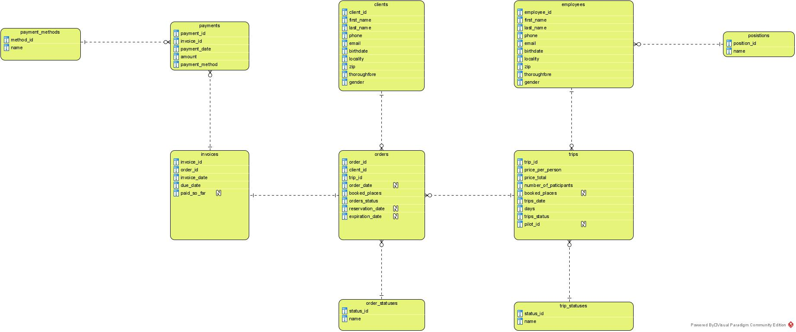
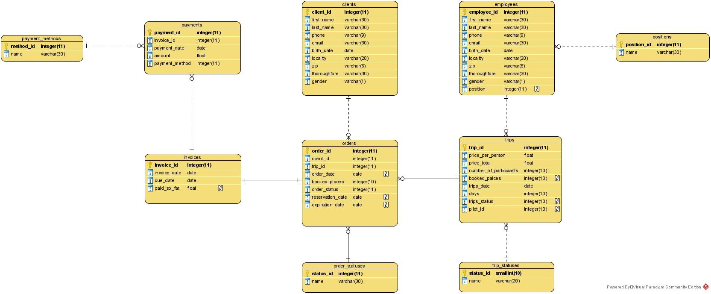
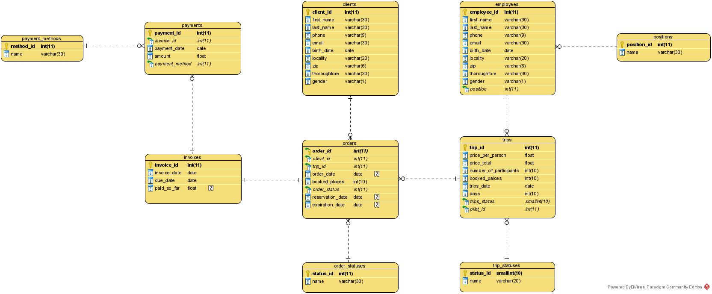

# travel_agency database

## Overview

tavel_agency is simple MySQL relational database, that was created for needs of [TravelAgency application](https://github.com/janjeziorny/TravelAgency). It contents all necessery data, views and functionalities, that allows the database user perform desired data operations as well as the users of TravelAgency application, which was mentioned above.

#

## Conceptual model

#

## Logical model

#

## Physical model

#

## Tables

As you can see above, there are 10 tables:
* clients,
* orders,
* order_statuses
* trips,
* trips_statuses
* employees,
* positions,
* invoices,
* payments,
* payment_methods. 

The relations between them, you can see on physical model.

#

### Views

There are 10 views, significant for travel_agency usage:
* <b>[selclients]</b> - extract all <i>clients</i> data,
* <b>[selemployees]</b> - extract all <i>employees</i> data with asigned <i>position</i>,
* <b>[selpositions]</b> - extract all <i>positions</i>,
* <b>[selorders]</b> - extract all <i>orders</i> data with asigned <i>client</i>, 
* <b>[selorder_statuses]</b> - extract all <i>order_statuses</i> data,
* <b>[selreservations]</b> - extract all reservation data from <i>orders</i> table,
* <b>[seltrips]</b> - extract all <i>trips</i> data with assigned <i>pilot</i>,
* <b>[selpilots]</b> - extract all <i>pilots</i> from <i>employees</i> table,
* <b>[selpayments]</b> - extract all <i>payments</i> data with asigned <i>client</i> and <i>invoice</i>,
* <b>[selpaymentmethods]</b> - extract all <i>payment_methods</i>.

*In the [travel_agency](https://github.com/janjeziorny/TravelAgencyDatabase/blob/main/travel_agency.sql) database is more views than mentioned above. I use them only to have an easier access to specyfied data from [TravelAgency application](https://github.com/janjeziorny/TravelAgency) code. While improving the application, these views going to be gradually removed, so I decided to not put them in this description.

#

## Stored procedures

In travel_agency database are defined 15 stored procedures:
* <b>spAddClient</b> - add <i>client</i> to database,
* <b>spAddEmployee</b> - add <i>employee</i> to database,
* <b>spAddOrder</b> - add <i>order</i> and appropriate <i>invoice</i> to database,
* <b>spAddPayment</b> - add <i>payment</i> to database,
* <b>spAddPosition</b> - add <i>position</i> to database,
* <b>spAddReservation</b> - add <i>reservation</i> to database,
* <b>spAddTrip</b> - add <i>trip</i> to database,
* <b>spConfirmReservation</b> - confirm specified <i>reservation</i> and add <i>order</i> and <i>invoice</i> based on that <i>reservation</i>,
* <b>spDeleteReservation</b> - cancel specified <i>reservation</i>,
* <b>spUpdateClient</b> - update specyfied value for specified <i>client</i>,
* <b>spUpdateEmployee</b> - update specified value for specified <i>employee</i>,
* <b>spUpdateInvoice</b> - update specified value for specified <i>invoice</i>,
* <b>spUpdateOrders</b> - update specified value for specified <i>order</i>,
* <b>spUpdatePayment</b> - update specified value for specified <i>payment</i>,
* <b>spUpdateTrip</b> - update specified value for specified <i>trip</i>.

The number of parameters and their type, you can check in [travel_agency database](https://github.com/janjeziorny/TravelAgencyDatabase/blob/main/travel_agency.sql) script.

#

## Events

In travel_agency database are defined 4 events:
* <b>Update_Reservation_Status</b> - every day: if the <i>expiration date</i> is <i>today</i>, set <i>status</i> as <i>expired</i>,

* <b>Update_Order_Status</b> - every day: if the <i>invoice</i> is paid off, set the <i>order status</i> as <i>done</i>,

* <b>Update_Past_Trip_Status</b> - every day: if the <i>trip date</i> is <i>today</i>, set <i>status</i> as <i>in proccess</i>,

* <b>Update_In_Proccess_Trip_Status</b> - every day: if the <i>trip</i> is over, set <i>status</i> as <i>past</i>.

#

## Summary

What you can see above is the general description of the. To get more specific information about it, just make your own instance of this database from the script, that you can find [here](https://github.com/janjeziorny/TravelAgencyDatabase/blob/main/travel_agency.sql).